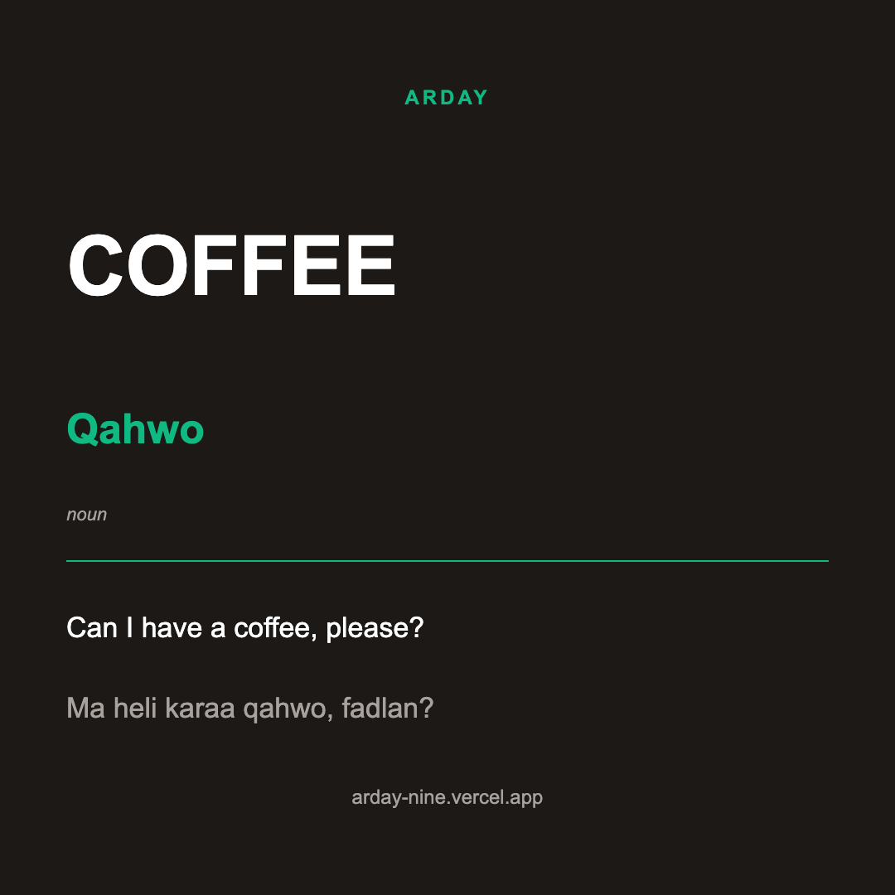
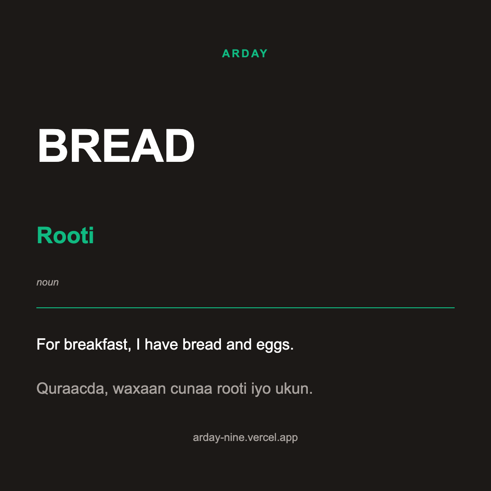
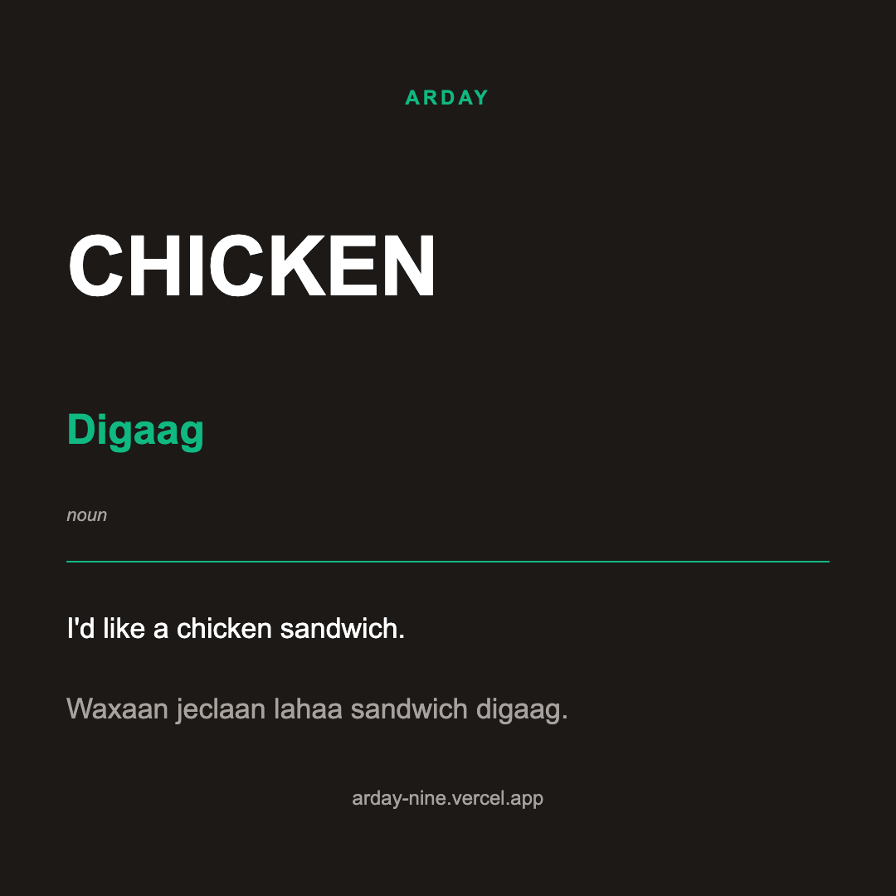

# Arday Social

<!-- STATUS:START -->
## Pipeline Status

| | |
|---|---|
| **Last posted** | 2026-04-30 |
| **Last word** | buses |
| **Caption style** | Style A |
| **Posts sent** | 6/6 (FB Feed, FB Story, FB Reel, IG Feed, IG Story, IG Reel) |
| **Total posts to date** | 1 |

## A/B Testing

| | |
|---|---|
| **Active test** | background-music |
| **Started** | 2026-04-08 |
| **Status** | Running |
| **Tests remaining** | 5 of 6 |

### Test Queue
- [ ] **background-music** (active)
- [ ] caption-style
- [ ] posting-time
- [ ] hashtag-set
- [ ] format-preference
- [ ] cta-vs-value


<!-- STATUS:END -->

**Automated daily Word of the Day pipeline — renders bilingual vocabulary cards and posts to Instagram and Facebook.**

The content engine for [Arday](https://arday-nine.vercel.app), a Somali-English language learning app. Every day at 8am UTC, this pipeline picks a word from a bank of 1,374 English-Somali vocabulary pairs, renders it as a card in three formats (feed, story, reel), and publishes 6 posts across Instagram and Facebook. No manual work. The word bank won't repeat for 3.7 years.

---

## Sample Output

<p align="center">
  
  &nbsp;&nbsp;
  
  &nbsp;&nbsp;
  
</p>

<p align="center">
  <em>Each card: English word, Somali translation, part of speech, bilingual example sentences.</em>
</p>

---

## Daily Output — 6 Posts

| Platform | Format | Dimensions |
|:---------|:-------|:-----------|
| Instagram Feed | Still image | 1080 x 1080 |
| Instagram Story | Still image | 1080 x 1920 |
| Instagram Reel | Video (10s) | 1080 x 1920 |
| Facebook Feed | Still image | 1080 x 1080 |
| Facebook Story | Still image | 1080 x 1920 |
| Facebook Reel | Video (10s) | 1080 x 1920 |

All six rendered from the same word data, adapted to each format's aspect ratio and content style.

---

## How It Works

```
GitHub Actions (8am UTC daily)
    |
    v
Word Selection — deterministic rotation through 1,374 pairs
    |
    v
Remotion Render — 3 formats: WordStill, WordStory, WordVideo
    |
    v
Cloudflare R2 — upload video for public URL (Reels require it)
    |
    v
Meta Graph API — post to Instagram + Facebook (feed, story, reel)
    |
    v
README Update — commit pipeline status back to repo
```

---

## Word Bank

1,374 English-Somali vocabulary pairs sourced from Arday's 120-lesson curriculum across 5 difficulty levels. Each entry includes:

- English word
- Somali translation
- Part of speech
- English example sentence
- Somali example sentence

At one word per day, the rotation runs for **3.7 years** before repeating.

---

## A/B Testing

Built-in experimentation framework for optimizing social media engagement:

| Test | What It Measures | Window |
|:-----|:-----------------|:-------|
| Background music | Reel engagement by backing track | 14–28 days |
| Caption style | Engagement by caption format | 30–45 days |
| Posting time | Best time of day for reach | 30–45 days |
| Hashtag set | Which hashtag groups drive discovery | 30–45 days |
| Format preference | Feed vs. story vs. reel performance | 30–45 days |
| CTA vs. value | Call-to-action vs. educational captions | 30–45 days |

Tests run sequentially. Variants alternate deterministically by day-of-year. `ab-report.ts` pulls engagement metrics from the Meta Graph API. `ab-optimize.ts` runs weekly and advances to the next test when a variant beats the other by ≥20%, or when `maxDays` is reached.

---

## Tech Stack

| | |
|:--|:--|
| Rendering | Remotion 4 (React-based video/image engine) |
| Runtime | TypeScript / Node.js 20 |
| Video hosting | Cloudflare R2 (public bucket) |
| Distribution | Meta Graph API |
| Scheduling | GitHub Actions (daily cron) |
| A/B testing | Custom framework with weekly auto-optimization |

---

## Architecture

```
src/
├── WordOfTheDay/
│   ├── Still.tsx            1080x1080 feed composition
│   ├── Story.tsx            1080x1920 story composition
│   └── Video.tsx            10s reel composition with swappable music
├── Promo/                   Standalone 15s/20s/30s marketing videos
├── components/
│   ├── WordCard.tsx         Shared card layout
│   └── ArdayBranding.tsx    Logo and footer
├── data/
│   ├── words.ts             1,374 vocabulary pairs + slug helper
│   ├── captions.ts          Style A / Style B templates
│   ├── ab-config.ts         Test queue + active test state
│   └── music.ts             Background music track registry
└── Root.tsx                 Remotion entry point
scripts/
├── auto-post.ts             Main pipeline — render + publish 6 posts
├── ab-report.ts             Fetches engagement metrics from Meta API
├── ab-optimize.ts           Picks winners, advances test queue
├── extract-words.ts         One-time: extracts vocab from SomLearn lessons
├── update-readme.ts         Regenerates the STATUS block in README
└── render-all.ts            Batch render all words locally
.github/workflows/
├── daily-post.yml           8am UTC cron
└── weekly-report.yml        Sunday 9am UTC A/B report
```

For a full architectural overview and the "why" behind design choices, see [`CLAUDE.md`](CLAUDE.md).

---

## Design

| Token | Value |
|:------|:------|
| Background | #1c1917 |
| Primary | #10b981 (emerald) |
| Heading | Plus Jakarta Sans, bold |
| Body | Plus Jakarta Sans, regular |
| Border radius | 6px / 10px / 14px |

Dark background with emerald accents. Matches the Arday app's visual identity.

---

## Setup

```bash
git clone https://github.com/ItsAbdiOk/arday-remotion.git
npm install
```

### Environment variables

Copy `.env.example` to `.env` and fill in:

```
META_PAGE_ACCESS_TOKEN          # Page-level token from /me/accounts (non-expiring)
META_PAGE_ID                    # Facebook Page ID
INSTAGRAM_BUSINESS_ACCOUNT_ID   # Linked Instagram Business account
R2_ACCESS_KEY_ID                # Cloudflare R2 token (Object R/W)
R2_SECRET_ACCESS_KEY
R2_BUCKET_NAME                  # e.g. arday-media
R2_PUBLIC_URL                   # e.g. https://pub-xxxx.r2.dev
R2_ENDPOINT                     # e.g. https://<account>.r2.cloudflarestorage.com
```

Full walkthrough — Meta App creation, token generation, R2 setup, GitHub secrets — is in [`README-autopost.md`](README-autopost.md).

### Run locally

```bash
npx ts-node scripts/auto-post.ts                  # Full pipeline
npx ts-node scripts/auto-post.ts --dry-run         # Render only, no posting
npx ts-node scripts/auto-post.ts --index 42        # Specific word by index
npm run ab-report                                  # Pull engagement metrics
npx ts-node scripts/render-all.ts                  # Batch render all words
```

---

## License

MIT

---

*Built by [Abdirahman Mohamed](https://abdirahmanmohamed.dev)*
